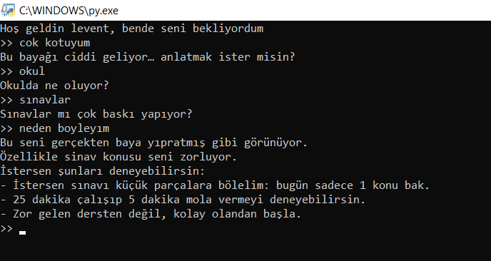

# 🤖 Jarvis – Türkçe Terminal Yapay Zekâ Asistanı

Jarvis, Python ile geliştirilmiş, Türkçe konuşabilen, duygu analizi yapabilen ve problemi adım adım keşfeden bir terminal yapay zekâ asistanıdır.

Bu proje tamamen öğrenme amaçlıdır ve sıfırdan mimari kurulmuştur.

---

## 🖥️ Demo



---

## 🚀 Özellikler

- Türkçe intent algılama
- Duygu durumu tespiti (iyi / kötü)
- State Machine tabanlı konuşma akışı
- Problem → alt problem zinciri
- Sebep analizi (`neden böyleyim`)
- Çözüm önerileri üretme
- Hafıza sistemi (memory)
- Anti-loop reflection sistemi

---

## 🧠 Nasıl Çalışıyor?

1. Kullanıcı mesajı normalize edilir  
2. Intent algılanır  
3. State kontrol edilir  
4. Problem tespit edilir  
5. Alt problemler sorgulanır  
6. Ağırlık hesaplanır  
7. `neden böyleyim` ile çözüm üretilir  

---

## 🛠 Kullanılan Teknolojiler

- Python  
- Rule-based NLP  
- State Machine mantığı  
- Custom memory sistemi  

---

## ▶️ Çalıştırma

```bash
python core.py


```md
## 📁 Proje Yapısı

jarvis-project/
│
├── core.py
├── commands.py
├── memory.py
└── screenshots/

---

## 🗺 Roadmap

- JSON tabanlı kalıcı hafıza  
- Log sistemi  
- GUI arayüz  
- Sesli giriş / çıkış  
- OpenAI entegrasyonu  
- Gelişmiş NLP  


---

## 👥 Geliştiriciler

Levent Efe Çiftçi

Safura Gurbanova

Bu proje iki öğrenci geliştirici tarafından yürütülmektedir.
Hedef: Backend & Yapay Zekâ.

---

## ⚠️ Not

Bu proje eğitim amaçlıdır.